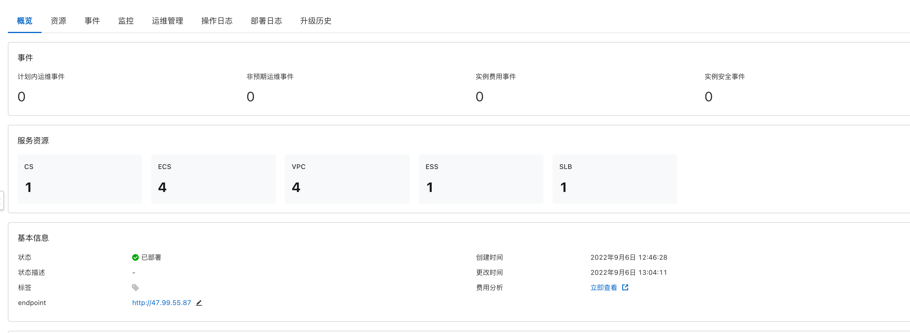
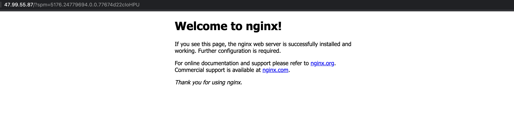

## 场景说明
本文介绍了在计算巢上新建ack并部署一个nginx的最佳实践，部署的架构为ack+ecs

部署预览

部署结果

## 架构图

暂无

## 部署

创建一个名为ManagedKubernetesCluster的ACK容器服务集群和EcsInstanceJumpBox的中控机，以及Eip和Slb
  * ACK容器服务集群（ManagedKubernetesCluster），用于部署容器资源。 
  * 中控机 (EcsInstanceJumpBox)，用于访问容器服务集群。容器服务部署和运维时，可以在中控机上应用或更新容器模板。
  * Eip和Slb用于绑定nginx对应的service对外提供公网服务 

模板中定义容器部署流程时，至少包含以下步骤：
  * 安装需要的容器资源管理客户端（helm/kubectl）。
  * 保存ACK集群的kubeconfig信息。
  * 应用定义的容器模板，在集群中创建容器资源。 

部署模版详见template.yaml

## 运维
* 使用中控机通过kubectl执行命令完成容器的后续运维

## 附录
参考文档
* 容器服务ack: https://ros.console.aliyun.com/resourceType/ALIYUN::CS::ManagedKubernetesCluster
* 云服务器ecs: https://ros.console.aliyun.com/resourceType/ALIYUN::ECS::InstanceGroup
