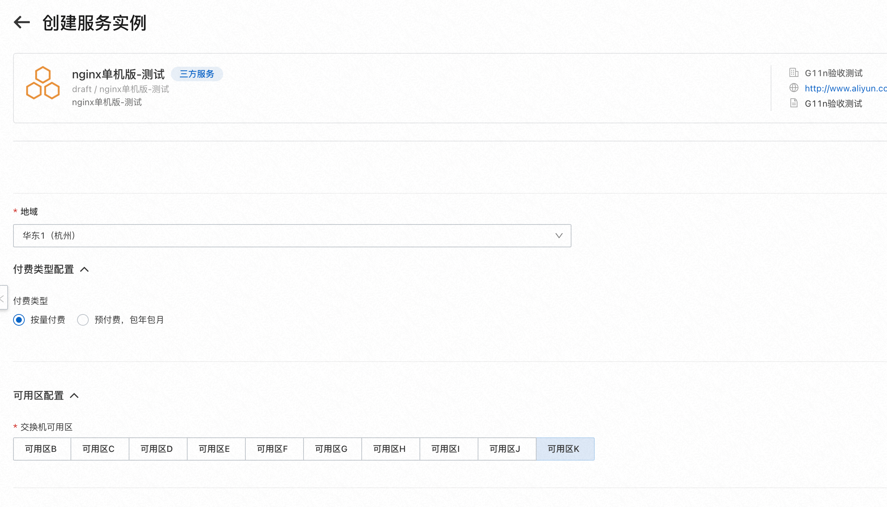
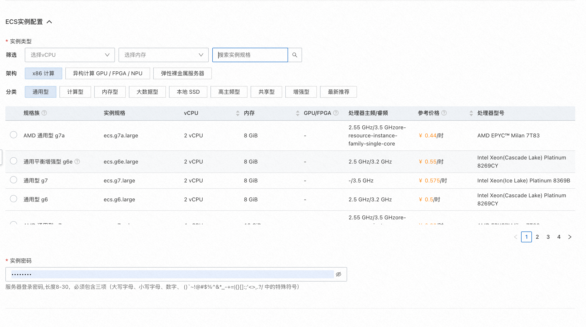
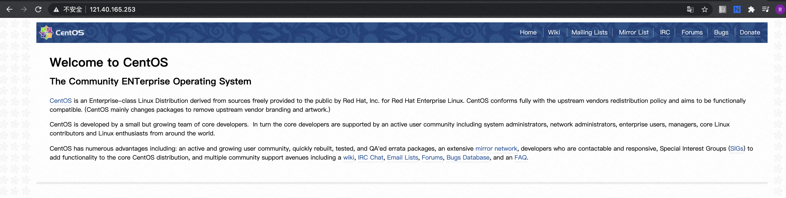

## 场景说明
本文介绍了在计算巢上基于ecs部署的场景
部署预览

部署结果

## 架构图
80端口 -> ecs(公网)

## 部署
* 基于ecs部署 UserData中可以添启动的命令
* 软件部署方法
   * 通过ecs创建镜像并通过计算巢的镜像分发功能，详见文档
      * 创建镜像部署物 https://help.aliyun.com/document_detail/432428.html
      * 镜像关联 https://help.aliyun.com/document_detail/406727.html
   * 通过软件包部署，可以使用计算巢的软件包分发功能，详见文档
      * 创建文件部署物 https://help.aliyun.com/document_detail/432428.html
      * 文件关联 #(待补充)

部署模版详见template.yaml

## 运维

通过计算巢的代运维登录到机器上完成运维

## 附录

参考文档
* 云服务器ecs: https://ros.console.aliyun.com/resourceType/ALIYUN::ECS::InstanceGroup