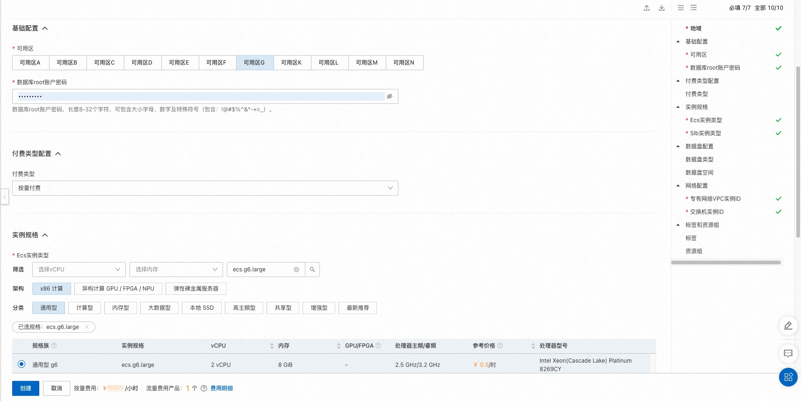
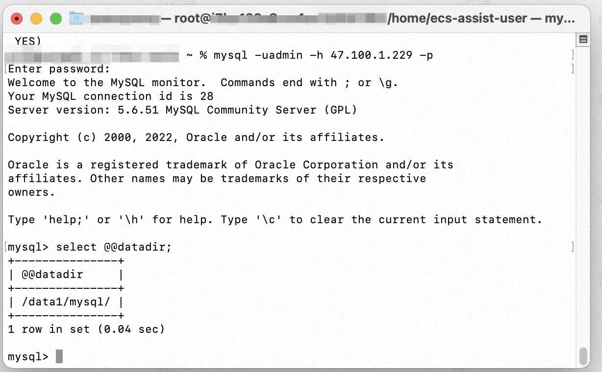

## 场景说明
本文介绍了在计算巢上新建Ecs并部署MySQL服务的最佳实践，通过Ecs公网IP进行远程连接，并将MySQL数据存储在数据盘。

**部署预览**

**部署结果**

## 架构图

## 部署

创建一个Ecs并为其分配公网IP，在Ecs上挂载数据盘作为MySQL的数据目录。
通过UserData在Ecs创建时进行初始化：
  * 挂载数据盘。
  * 安装MySQL社区版。
  * 在数据库中创建admin用户，并允许以admin用户远程连接数据库。
  * 将MySQL目录移动到数据盘目录下。

部署模版详见template.yaml

## 运维
* 通过公网IP远程连接到Ecs中进行运维操作。

## 附录