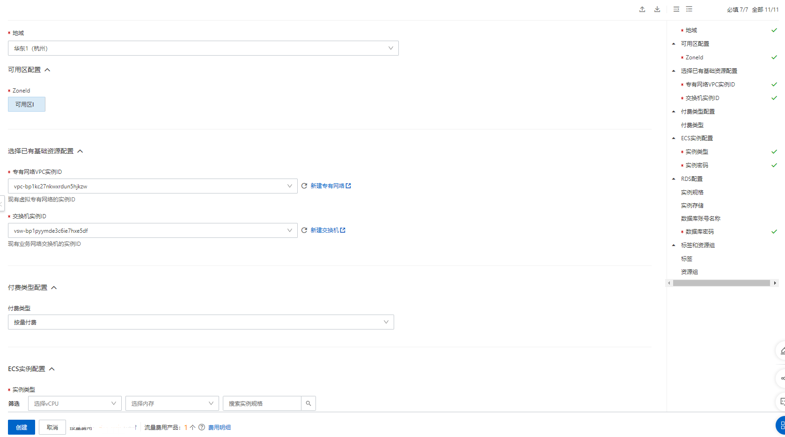

## 场景说明
本文介绍了在计算巢上sqlserver+ecs的部署架构

部署预览

部署结果

## 架构图

## 部署
创建ecs和sqlserver实例并通过runcommand到ecs中执行PowerShell命令，并把rds对应的数据库账号密码和地址传入到脚本中执行Sql语句完成数据库的初始化

## 运维
通过计算巢的代运维登录到机器上完成运维

## 附录
参考文档
* [云服务器ecs](https://ros.console.aliyun.com/resourceType/ALIYUN::ECS::InstanceGroup)
* [云数据库rds](https://ros.console.aliyun.com/resourceType/ALIYUN::RDS::DBInstance)
* [到云服务器执行命令](https://ros.console.aliyun.com/resourceType/ALIYUN::ECS::RunCommand)