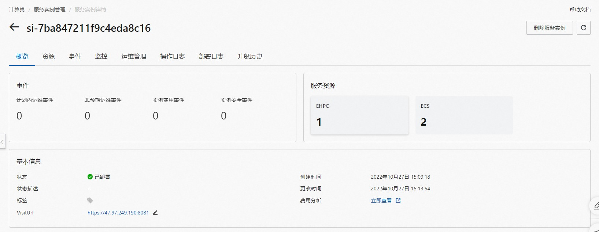
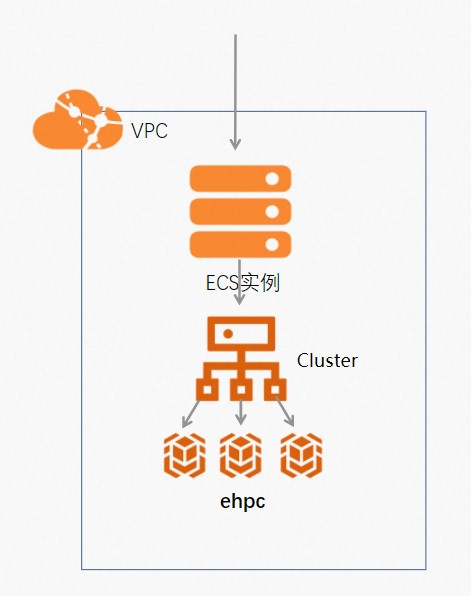

## 场景说明
本文介绍了在计算巢上利用Cluster创建弹性高性能计算集群

部署预览

部署结果

## 架构图

## 运维
通过计算巢的代运维登录到机器上完成运维
## 附录
参考文档
* [云服务器ecs](https://ros.console.aliyun.com/resourceType/ALIYUN::ECS::InstanceGroup)
* [Cluster](https://help.aliyun.com/document_detail/155272.html)
* [到云服务器执行命令](https://ros.console.aliyun.com/resourceType/ALIYUN::ECS::RunCommand)