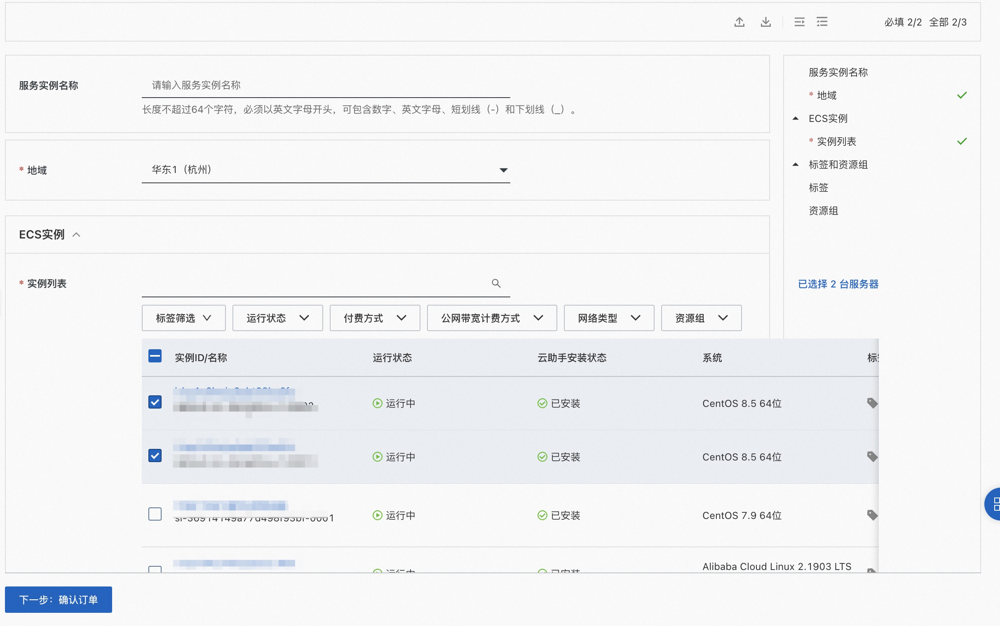

## 场景说明
本文介绍在计算巢上为现存ecs部署nginx的架构

部署预览

部署结果

## 架构图

## 部署

现存ecs部署nginx

## 运维
通过计算巢的代运维登录到机器上完成运维
## 附录
参考文档
* [云服务器ecs信息查询](https://www.alibabacloud.com/help/zh/resource-orchestration-service/latest/datasource-ecs-instances)
* [到云服务器执行命令](https://ros.console.aliyun.com/resourceType/ALIYUN::ECS::RunCommand)