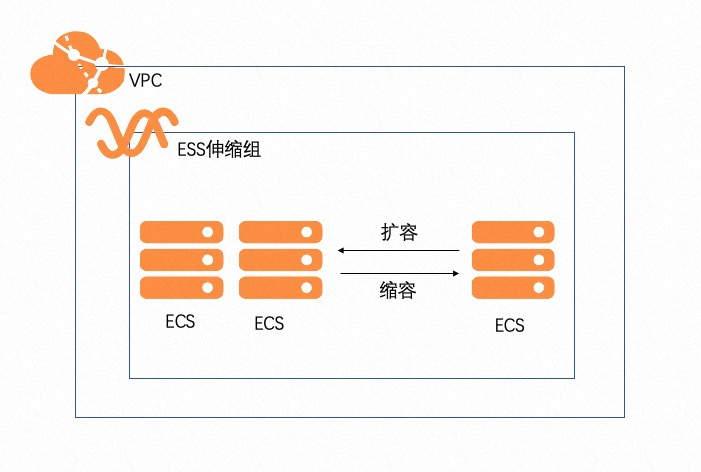

## 场景说明
本文介绍了在计算巢上新建一组带有伸缩组的ecs架构

部署预览

部署结果

## 架构图

## 部署
部署模版详见template.yaml

## 运维

## 附录
参考文档
* [云服务器ecs](https://ros.console.aliyun.com/resourceType/ALIYUN::ECS::InstanceGroup)
* [弹性伸缩ess](https://ros.console.aliyun.com/resourceType/ALIYUN::ESS::ScalingGroup)