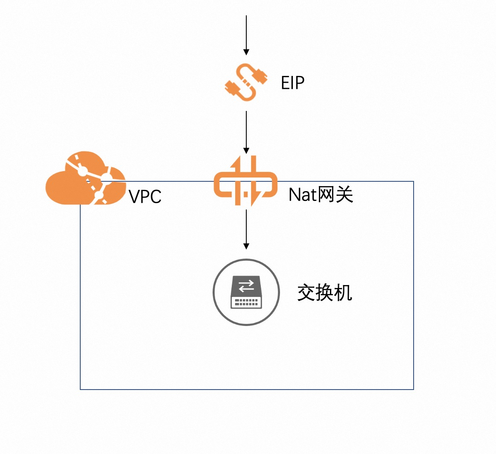

## 场景说明
本文介绍了在计算巢上新建VPC、VSwitch、NatGateway并绑定EIP的最佳实践。

部署预览

部署结果

## 架构图

## 部署
模板中部署资源时有以下步骤：
  * 创建VPC、VSwitch、NatGateway和EIP
  * 绑定NatGateway和EIP
  * 配置NatGateway中的源地址转换表

部署模版详见template.yaml

## 运维

## 附录
参考文档
* [专有网络Vpc](https://ros.console.aliyun.com/resourceType/ALIYUN::ECS::VPC)
* [VSwitch](https://ros.console.aliyun.com/resourceType/ALIYUN::ECS::VSwitch)
* [NatGateway](https://ros.console.aliyun.com/resourceType/ALIYUN::VPC::NatGateway)
* [EIP](https://ros.console.aliyun.com/resourceType/ALIYUN::VPC::EIP)
