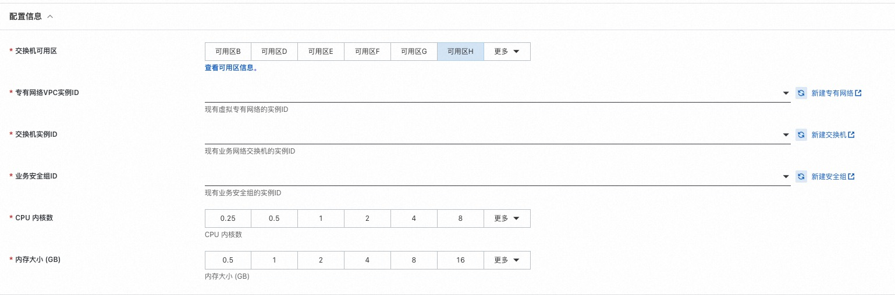
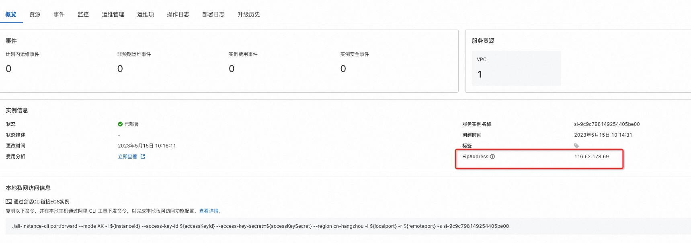

## 场景说明
本文介绍了在计算巢部署ECI实例，并绑定EIP提供公网访问。ECI实例使用Nginx镜像作为示例。

部署预览

部署结果

## 部署

创建eci实例并绑定EIP

## 附录
参考文档
* [ECI实例](https://help.aliyun.com/document_detail/134910.html)
* [EIP](https://help.aliyun.com/document_detail/102190.html)