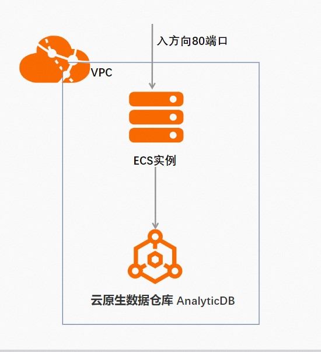

## 场景说明
本文介绍了在计算巢上ecs+adbpg的部署架构

## 部署预览

## 部署结果

## 架构图

## 部署
创建ecs和云原生数据仓库 AnalyticDB PostgreSQL版，并连接

## 运维
通过计算巢的代运维登录到机器上完成运维

## 附录
参考文档
* [云服务器ecs](https://ros.console.aliyun.com/resourceType/ALIYUN::ECS::InstanceGroup)
* [AnalyticDB PostgreSQL](https://help.aliyun.com/document_detail/288271.html?spm=a2c4g.288251.0.0.37a53fbdJW1sgc)
* [到云服务器执行命令](https://ros.console.aliyun.com/resourceType/ALIYUN::ECS::RunCommand)