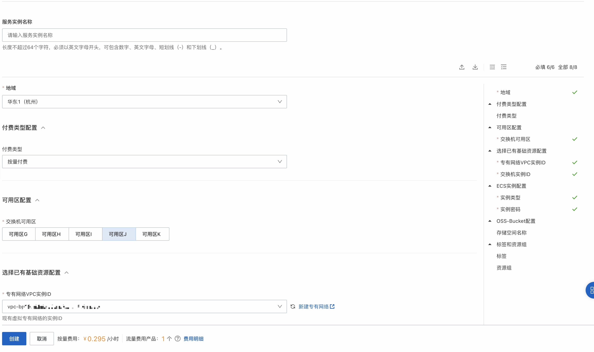
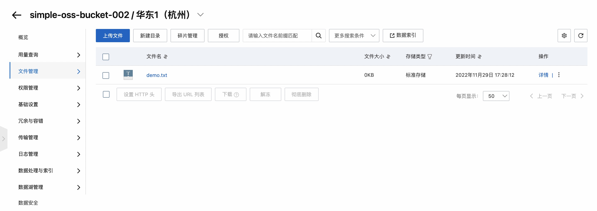
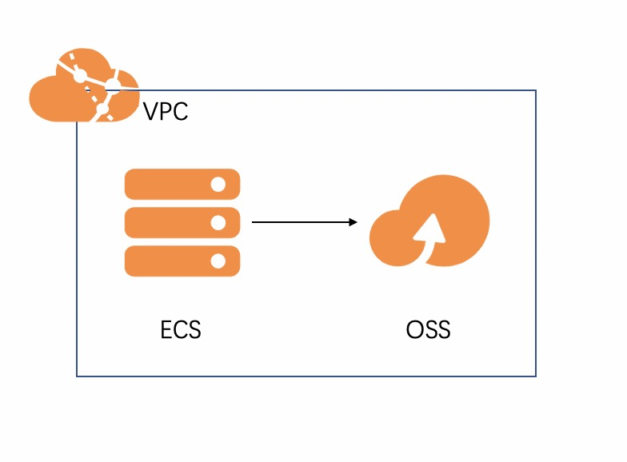

## 场景说明
本文介绍了在计算巢上ecs+ramrole+oss的部署架构

部署预览

部署结果

## 架构图

## 部署

使用已有VPC、VSWitch创建ECS实例，通过RAMRole进行免密访问OSS-Bucket。

## 运维
通过计算巢的代运维登录到机器上完成运维

## 附录
参考文档
* [云服务器ecs](https://ros.console.aliyun.com/resourceType/ALIYUN::ECS::InstanceGroup)
* [访问控制ram](https://ros.console.aliyun.com/resourceType/ALIYUN::RAM::ROLE)
* [对象存储oss](https://ros.console.aliyun.com/resourceType/ALIYUN::OSS::Bucket)
