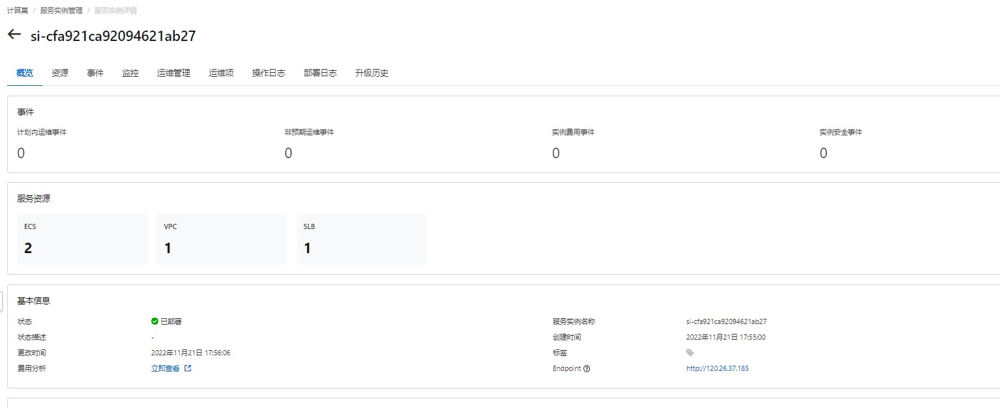
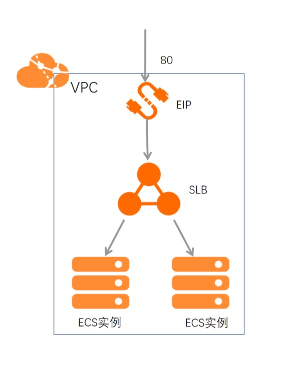

## 场景说明
本文介绍了在计算巢上ecs + slb的部署架构

部署预览

部署结果

## 架构图

## 部署
创建ecs和slb实例

## 运维
通过计算巢的代运维登录到机器上完成运维

## 附录
参考文档
* [云服务器ecs](https://ros.console.aliyun.com/resourceType/ALIYUN::ECS::InstanceGroup)
* [负载均衡SLB](https://ros.console.aliyun.com/resourceType/ALIYUN::SLB::LoadBalancer)
* [到云服务器执行命令](https://ros.console.aliyun.com/resourceType/ALIYUN::ECS::RunCommand)