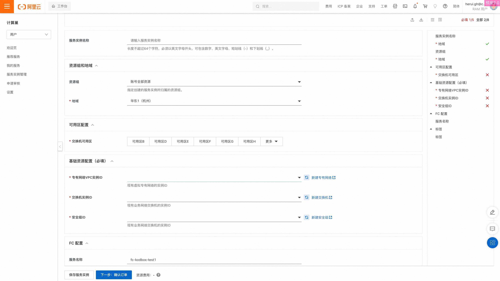
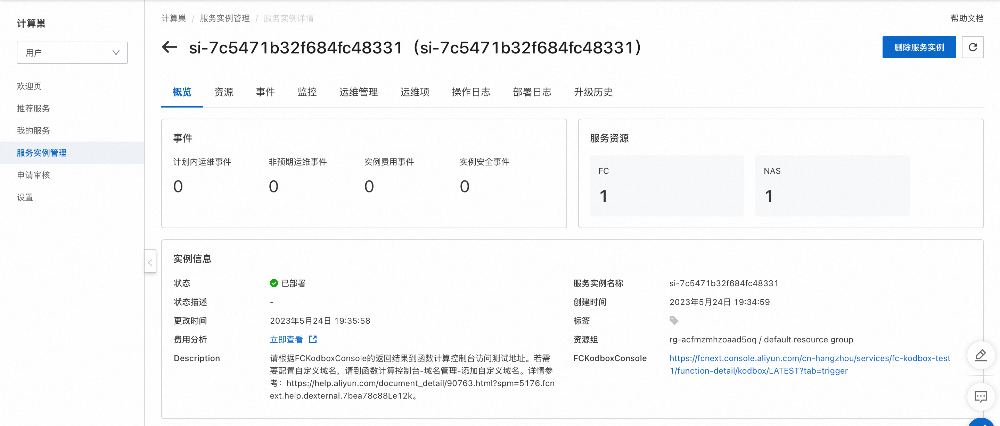
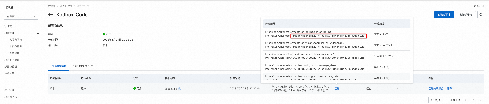
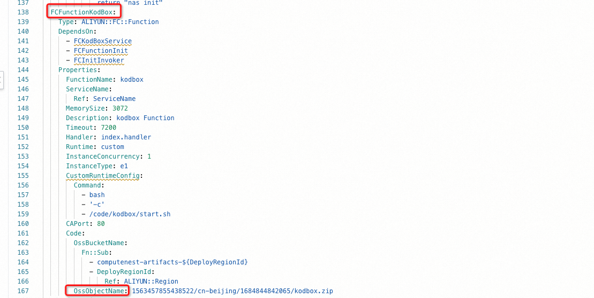

## 场景说明
本文介绍了通过计算巢快速部署一个NAS+OSS UI文件管理系统(Kodbox)到阿里云函数计算。

部署预览

部署结果

## 部署

#### 服务商资源准备
* 使用自定义运行时创建的函数需要设置代码源，推荐使用计算巢文件部署物的分发功能来进行代码源配置。
* 部署管理中创建文件部署物，上传代码压缩包：

* 查看文件部署物的分发结果，获取到OSS存储的Object Name

#### 创建服务
* 部署模版详见template.yml.
* 修改模版中FCFunctionKodBox资源的Code属性，设置OssObjectName为上个步骤中获取到的结果。 
* 注意: OssBucketName无需更改。

#### 创建服务实例
* 按要求填写参数，注意FC配置中的服务名称，每个用户在一个地域下服务名称不允许重复。

