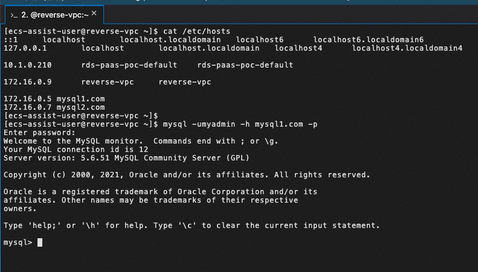
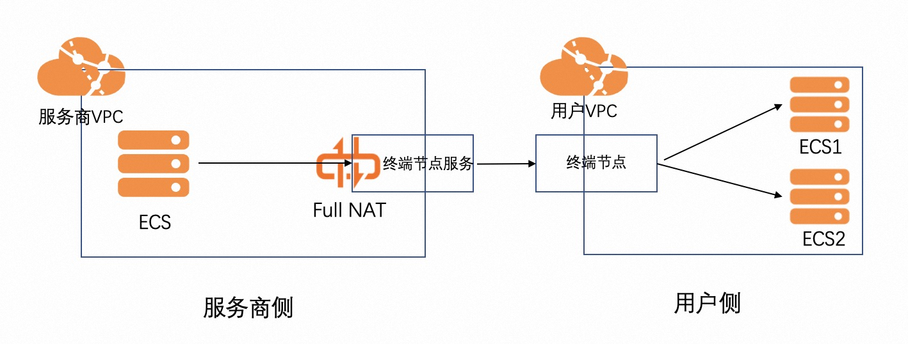
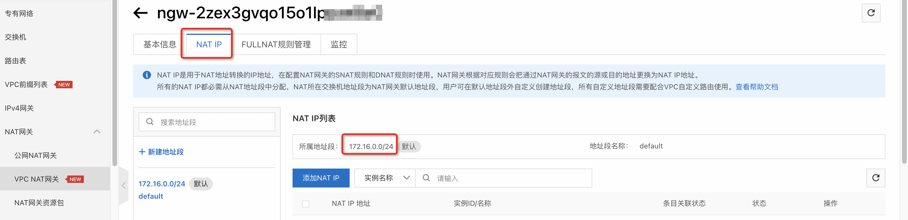
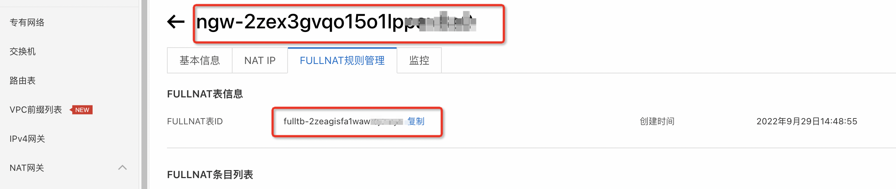
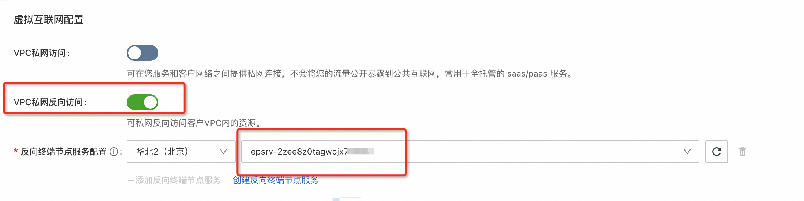

## 场景说明
本文介绍了在计算巢全托管服务私网反向访问的最佳实践，基于PrivateLink，您可以跨VPC打通从服务商到用户服务的私网链路。

部署预览


部署结果





## 架构图


## 部署

#### 资源准备
* 服务商在需要的可用区预创建FullNAT类型的NatGateway，并将可用区和NatGatewayId进行参数映射。（当前无法从控制台创建FullNAT类型的NatGateway，暂时只能通过API或ROS创建）

```java
import com.aliyuncs.DefaultAcsClient;
import com.aliyuncs.IAcsClient;
import com.aliyuncs.exceptions.ClientException;
import com.aliyuncs.exceptions.ServerException;
import com.aliyuncs.profile.DefaultProfile;
import com.google.gson.Gson;
import java.util.*;
import com.aliyuncs.vpc.model.v20160428.*;

public class CreateNatGateway {

    public static void main(String[] args) {
        DefaultProfile profile = DefaultProfile.getProfile("cn-hangzhou", "<accessKeyId>", "<accessSecret>");
        IAcsClient client = new DefaultAcsClient(profile);

        CreateNatGatewayRequest request = new CreateNatGatewayRequest();
        request.setRegionId("cn-hangzhou");
        request.setVpcId("vpc-xxxxxx");
        request.setName("test");
        request.setVSwitchId("vsw-xxxxxx");
        request.setNatType("Enhanced");
        request.setInstanceChargeType("PostPaid");
        request.setNetworkType("intranet");
        request.putQueryParameter("PrivateLinkEnabled", "true");
        request.putQueryParameter("PrivateLinkMode", "Fullnat");

        try {
            CreateNatGatewayResponse response = client.getAcsResponse(request);
            System.out.println(new Gson().toJson(response));
        } catch (ServerException e) {
            e.printStackTrace();
        } catch (ClientException e) {
            System.out.println("ErrCode:" + e.getErrCode());
            System.out.println("ErrMsg:" + e.getErrMsg());
            System.out.println("RequestId:" + e.getRequestId());
        }

    }
}
```


* 服务商在需要的可用区预创建终端节点服务，并将终节点服务和上一步创建的NAT网关ID进行映射。


* 模拟用户侧服务，在另一VPC下创建ECS，本文以访问MySQL服务为例，创建了两个ECS，安装MySQL服务并允许远程连接。


#### 创建服务
* 部署模版详见template.yml。
注意：模板中的AccessDomain、AccessIp和AccessPort分别对应服务商请求用户服务使用的域名、用户侧服务内网IP和用户侧服务端口，其中AccessDomain非必填，AccessIp和AccessPort为必填参数。参数名称必须为AccessDomain、AccessIp和AccessPort，否则服务将不能识别配置。

* 在参数映射关系处，将RegionId和VpcId、NatGatewayId、FullNatTableId、NatIpCidr进行映射，将ZoneId和VSwitchId、SecurityGroupId进行映射，VPC、NatGateway、安全组和VSwitch为准备工作阶段创建的资源。



* 配置虚拟互联网配置，勾选VPC私网反向访问，并填入准备节点创建的终端节点服务ID。



#### 创建服务实例
* 填入反向访问参数，可以配置多个需要反向访问的用户服务。这里填写两个MySQL测试实例的私网IP和端口。


* 填入专有网络信息，此处需要填入用户侧的网络信息，并且安全组的入方向需要对目标端口放行。

